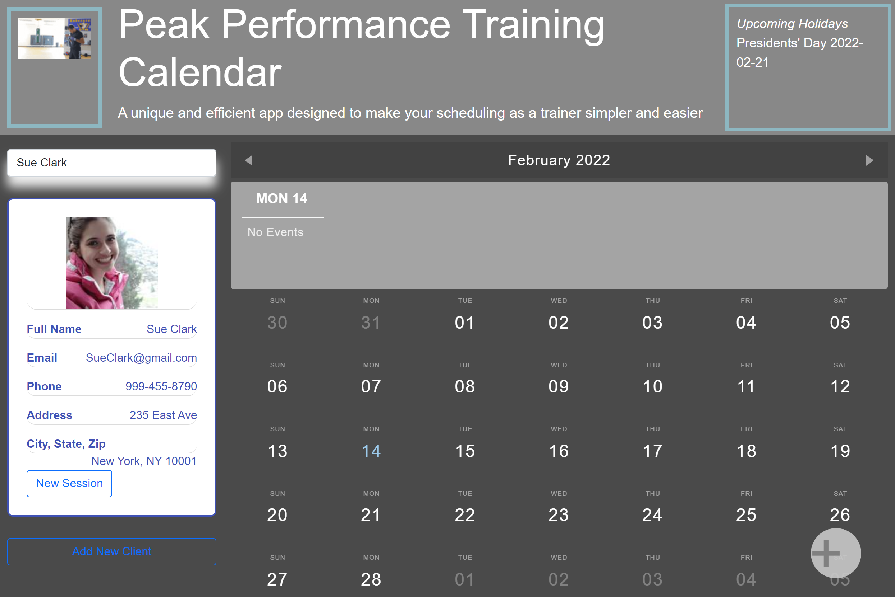

# Peak-Performance
 
## Table of Contents
- [User Story](#user-story)
- [General Information](#general-information)
- [Website](#website)
- [Screenshots](#screenshots)
- [Code Used](#code-used)
- [Api Used](#api-used)
- [Status](#status)
- [Inspired By](#inspired-by)
- [Acceptance Criteria](#acceptance-criteria)
- [Collaboratrs](#collaborators)

## User Story 
```
 AS A Professional Trainer with many clients
 I WANT TO keep track of client payments and my master schedule 
 SO THAT I can organize and track my schedule
```

## General Information
A unique and efficient app designed to make your scheduling as a trainer simpler and easier. 

## Website 
[Check out our app here!](https://laurenagra.github.io/Peak-Performance/)

## Screenshots


## Code Used 
- HTML
- CSS
- Javascript

## API Used 
- [Image API](https://developers.giphy.com/docs/api#quick-start-guide)
- [Holidays](https://calendarific.com/api-documentation)


## Status
- This project is incomplete as of February 14

## Inspired By 
- GT Coding Bootcamp Project 1
- Personal Design Preference of Team

## Acceptance Criteria
```
GIVEN WHEN the page loads 
THEN a calendar and existing clients are displayed 
THEN the user able to add a new client 
WHEN the user needs to schedule a new session
THEN they click on New Session or + and are able to fill out a form with information about prices and money
AND WHEN the user clicks add event 
THEN the session is appended to the calendar and color coordinated.
```


## Collaborators 
- [Lauren Agra](https://github.com/laurenagra)
- [Jamille Rooks](https://github.com/jamillerooks)
- [Brian Garcia](https://github.com/itsbrianfire)
- [Derrick Hinton](https://github.com/dahint207)